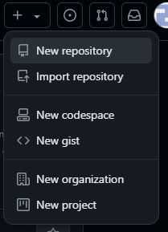
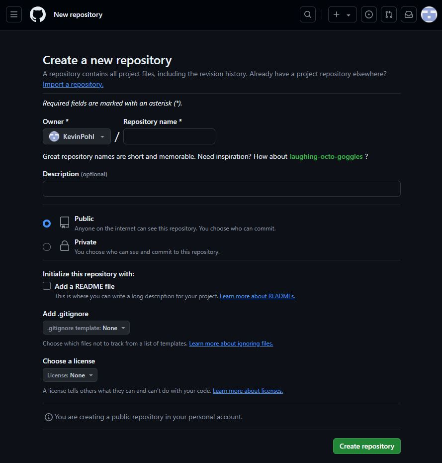
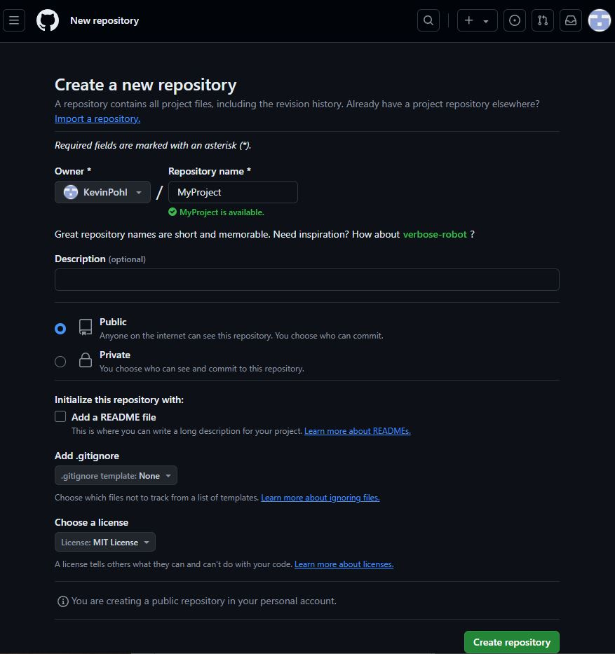
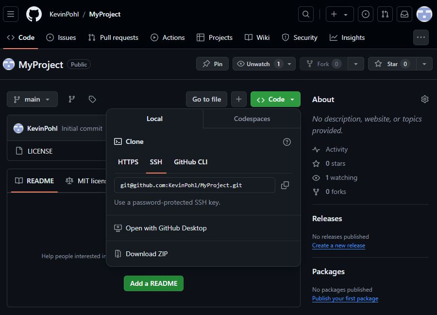
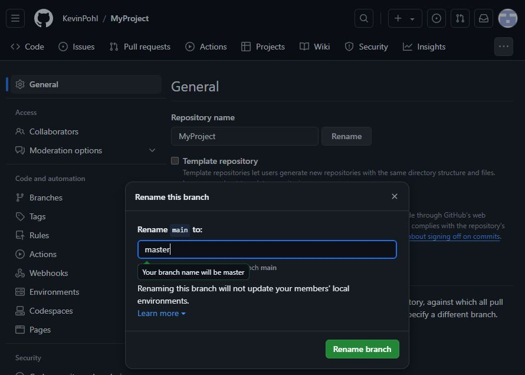
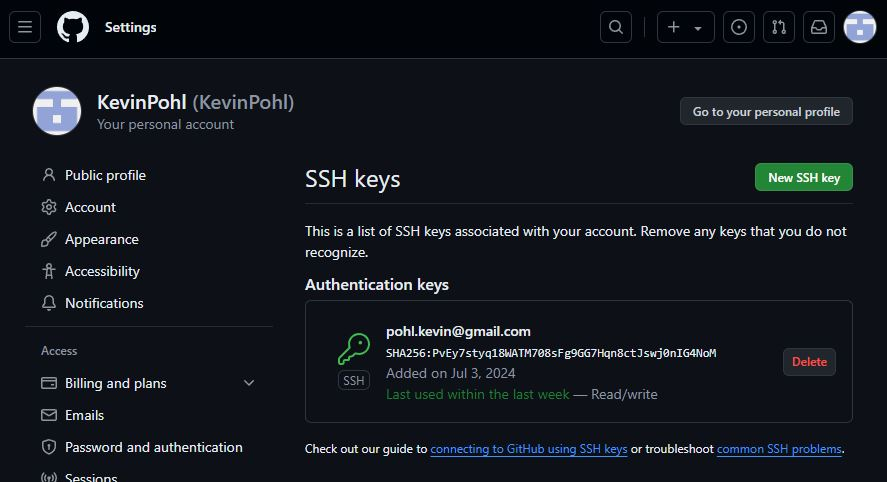
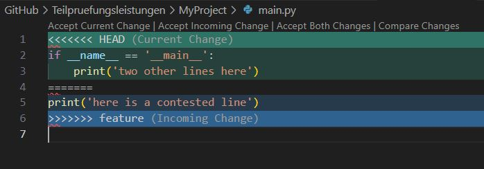
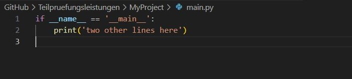

## MyProject

### environment
I work on a windows computer with bash in Visual Studio Code.

### create public repository on GitHub
With a click on the "+"-sign in the upper left corner on the GitHub main page a dropdown opens:

There a click on "New Repository" opens a new site:

Filled out, the form looks like this:

After creating the repository, i look up the link to the repository from the Code Button

From there i keep the link [git@github.com:KevinPohl/MyProject.git](git@github.com:KevinPohl/MyProject.git) for later use.
After that i rename the main branch into master in the repository settings.

### setting up the ssh key
The command `$ ls ~/.ssh/` leads to this output:
```git
id_rsa_github  id_rsa_github.pub  known_hosts  known_hosts.old
```
There is no further need to set up a new ssh key, as the files id_rsa_github and id_rsa_github.pub are already present in the directory, the .pub is uploaded to GitHub, as the page [https://github.com/settings/keys](https://github.com/settings/keys) shows.

## create local repository
changing to favored local project directory with these commands
`$ cd /e/Program\ Files/velptec/GitHub/Teilpruefungsleistungen/`

cloning the online repository locally with
`$ git clone git@github.com:KevinPohl/MyProject.git`
```git
Cloning into 'MyProject'...
remote: Enumerating objects: 3, done.
remote: Counting objects: 100% (3/3), done.
remote: Compressing objects: 100% (2/2), done.
remote: Total 3 (delta 0), reused 0 (delta 0), pack-reused 0
Receiving objects: 100% (3/3), done.
```
There i first create a folder to save all screenshots
`$ mkdir MyProject/screenshots`
and move all currently created screenshots there, which were temporarily saved in the subfolder "screenshots" of the main directory "Teilpruefungsleistungen":
`$ mv ./screenshots/ ./MyProject/`

Then, i move this document to the project folder, which was temporarily saved in the main directory Teilpruefungsleistungen and was called README\.md:
`$ mv README.md ./MyProject/`

After that, i change the directory to the project directory with `$ cd MyProject`.

As the config is already set up, there's no need to run the commands
`$ git config user.name "Kevin Pohl"` and
`$ git config user.email "pohl.kevin@googlemail.com"`.

`$ git config --get user.name`
```git
Kevin Pohl
```
`$ git config --get user.email`
```git
pohl.kevin@googlemail.com
```
### initial commit
I create the file main\.py in MyProject with `$ touch main.py`, add several files to staging:
`$ git add main.py`
```git
```
`$ git add README.md`
```git
```
`$ git add ./screenshots/*`
```git
```
and do an initial commit:
`$ git commit -m "initial commit"`
```git
[master dc68613] initial commit
 8 files changed, 125 insertions(+)
 create mode 100644 README.md
 create mode 100644 main.py
 create mode 100644 screenshots/new_repo_1.jpg
 create mode 100644 screenshots/new_repo_2.jpg
 create mode 100644 screenshots/new_repo_3.jpg
 create mode 100644 screenshots/new_repo_4.jpg
 create mode 100644 screenshots/new_repo_5.jpg
 create mode 100644 screenshots/ssh_key.jpg
```
I create and activate a new branch named feature `$ git checkout -b feature` (personally, i prefer `$ git switch -c feature`):
```git
Switched to a new branch 'feature'
```
On branch feature, i create a subdirectory and a file inside:
`$ mkdir utils`
`$ touch ./utils/database.py`.

As a merge conflict should be provoked, i make an additional change in main\.py, else there wouldn't be a conflict.
`$ printf "print('here is a contested line')" > main.py`

I add and commit the changes:
`$ git add utils/database.py`
`$ git add main.py`
```git
```
`$ git commit -m "new feature added"`
```git
[feature d707991] new feature added
 2 files changed, 1 insertion(+)
 create mode 100644 utils/database.py
```
Back to master with
`$ git checkout master`
```git
Switched to branch 'master'
M       README.md
Your branch is ahead of 'origin/master' by 1 commit.
  (use "git push" to publish your local commits)
```
i add some code to main.py on this branch with:
`$ printf "if __name__ == '__main__':\n\tprint('two other lines here')" > main.py`

I then add the file to staging and commit
`$ git add main.py`
```git
warning: in the working copy of 'main.py', LF will be replaced by CRLF the next time Git touches it
```
`$ git commit -m "updated main file"`
```git
[master b7ed74b] updated main file
 1 file changed, 2 insertions(+)
```
Trying to merge feature into main and trigger a merge conflict, because both branches changed the file main\.py:
`$ git merge feature`
```git
Auto-merging main.py
CONFLICT (content): Merge conflict in main.py
Automatic merge failed; fix conflicts and then commit the result.
```
`$ git status`
```git
On branch master
Your branch is ahead of 'origin/master' by 2 commits.
  (use "git push" to publish your local commits)

You have unmerged paths.
  (fix conflicts and run "git commit")
  (use "git merge --abort" to abort the merge)

Changes to be committed:
        new file:   utils/database.py

Unmerged paths:
  (use "git add <file>..." to mark resolution)
        both modified:   main.py

Changes not staged for commit:
  (use "git add <file>..." to update what will be committed)
  (use "git restore <file>..." to discard changes in working directory)
        modified:   README.md
```
I open main.py and see the two different states:

I decide to accept the current change from the master branch and delete everything else:

I then add main.py, README.md, and two more screenshots and commit the changes.
`$ git add main.py`
```git
```
`$ git add README.md`
```git
```
`$ git add ./screenshots/*`
```git
```
and do the final commit:
`$ git commit -m "added missing and resolved files"`


